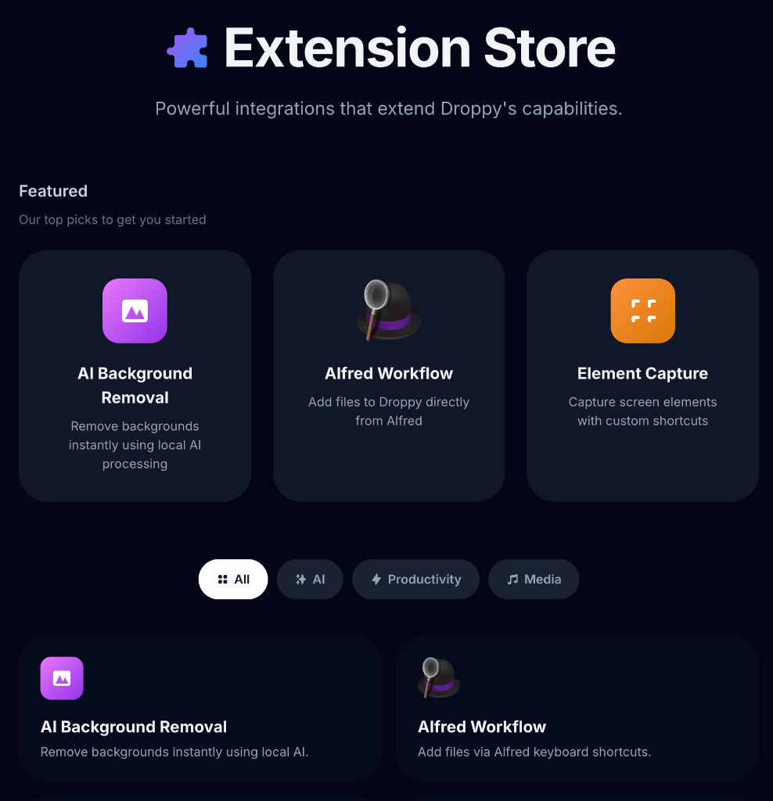

<p align="center">
  
</p>

<h1 align="center">Droppy</h1>

<p align="center">
  <strong>Your all-in-one Mac productivity companion.</strong><br>
  <em>Free, open-source, and built entirely in Swift.</em>
</p>

<p align="center">
    <a href="https://iordv.github.io/Droppy/"></a>
    <a href="https://github.com/iordv/Droppy/releases/latest"></a>
    <a href="https://github.com/iordv/Droppy/releases/latest"></a>
    
    <a href="LICENSE"></a>
</p>

---

<div align="center">


**See it in action on [our website](https://iordv.github.io/Droppy/)!**

</div>

---

## What's Droppy?

Ever wish your Mac's notch did something useful? Droppy turns it into a file shelf, clipboard manager, media controller, and more — all in one beautiful interface.

**No notch? No problem.** Droppy creates a sleek Dynamic Island-style pill that works on any Mac.

### The basics:

- **Drag files to the notch** — they slide into a hidden shelf, ready whenever you need them
- **Jiggle your mouse while dragging** — a floating basket appears anywhere on screen  
- **Full clipboard history** — search, pin favorites, extract text from images, drag items out
- **Media controls in the notch** — album art, seek slider, shuffle/repeat, Spotify integration

---

## Features at a Glance

<p align="center">
  
</p>

---

## Everything Included

Droppy packs a lot into a tiny package:

| | |
|:---|:---|
| **File Shelf & Basket** | Stash files in your notch or summon a floating basket with a mouse jiggle |
| **Clipboard Manager** | Full history, search, favorites, OCR text extraction, drag-out |
| **Now Playing** | Album art, playback controls, seek slider, lyrics (needs Spotify extension) |
| **Quick Actions** | Right-click to compress, convert formats, extract text, move, share |
| **Custom HUDs** | Volume, brightness, battery, caps lock — beautiful replacements for system overlays |
| **AirPods HUD** | Battery levels and connection status when your AirPods connect |
| **Auto-Hide & Peek** | Basket slides to the edge when idle, peeks when you hover |
| **Multi-Monitor** | Works on external displays with smart fullscreen detection |

---

## 🧩 Extension Store

<p align="center">
  
</p>

Droppy's built-in Extension Store lets you add powerful features on demand. Everything's free and included — just toggle what you need.

**Available extensions:**

- **AI Background Removal** — Remove backgrounds from images locally using machine learning
- **Alfred Workflow** — Add files to Droppy directly from Alfred  
- **Finder Services** — Right-click any file in Finder to send it to Droppy
- **Spotify Integration** — Full playback control with lyrics and album art
- **Element Capture** — Screenshot any UI element with customizable shortcuts

<p align="center">
  <a href="https://iordv.github.io/Droppy/extensions.html">
    
  </a>
</p>

---

## Install

### Homebrew (recommended)
```bash
brew install --cask iordv/tap/droppy
```

### Manual Download
1. Download [**Droppy.dmg**](https://github.com/iordv/Droppy/releases/latest)
2. Clear quarantine (required for unsigned apps):
   ```bash
   xattr -rd com.apple.quarantine ~/Downloads/Droppy-*.dmg
   ```
3. Open the DMG and drag Droppy to Applications

> 💡 Homebrew handles quarantine automatically and makes updates easy.

---

## Quick Reference

| What you want | How to do it |
|:---|:---|
| Stash a file | Drag it to the notch |
| Summon the basket | Jiggle your mouse while dragging |
| Open clipboard | `⌘ + Shift + Space` |
| Paste from history | Navigate with `↑↓`, hit `Enter` |
| Quick actions | Right-click any file in Droppy |

---

## Support the Project

<p align="center">
  <strong>Free forever — no ads, no subscriptions.</strong><br>
  If Droppy saves you time, consider buying me a coffee.
</p>

<p align="center">
  <a href="https://buymeacoffee.com/droppy">
    
  </a>
</p>

---

<p align="center">
  <strong><a href="LICENSE">GPL-3.0 + Commons Clause</a></strong> — Source available, not for resale.<br>
  <a href="TRADEMARK">Droppy™</a> by <a href="https://github.com/iordv">Jordy Spruit</a>
</p>
