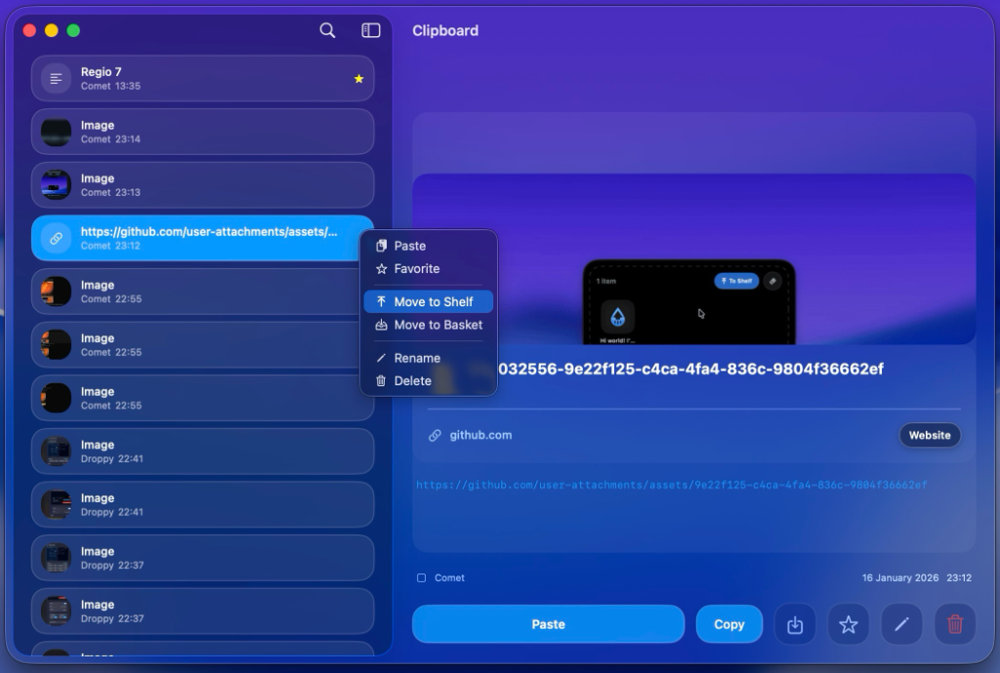

<p align="center">
  
</p>

<h1 align="center">Droppy</h1>

<p align="center">
  <strong>The native productivity layer macOS is missing.</strong><br>
  <em>Free, open-source, and built entirely in Swift.</em>
</p>

<p align="center">
    <a href="https://github.com/iordv/Droppy/releases/latest"></a>
    
    <a href="LICENSE"></a>
    <a href="https://buymeacoffee.com/droppy"></a>
    <a href="https://discord.gg/ghMSjHRa"></a>
</p>

---

<p align="center">
  
</p>

<p align="center">
  <a href="https://iordv.github.io/Droppy/"><strong>🌐 Website</strong></a> · 
  <a href="https://github.com/iordv/Droppy/releases/latest"><strong>⬇️ Download</strong></a> · 
  <a href="https://iordv.github.io/Droppy/extensions.html"><strong>🧩 Extensions</strong></a> · 
  <a href="https://discord.gg/ghMSjHRa"><strong>💬 Discord</strong></a>
</p>

---

## What is Droppy?

Droppy is a native productivity layer for macOS. It started as a way to make the MacBook notch actually useful — drop files in, stash them, drag them out anywhere. But it quickly grew into something much bigger.

Today, Droppy is a full-fledged productivity suite. A clipboard manager that remembers everything you copy. A menu bar manager to hide icon clutter. Media controls with live visualizers. AI-powered background removal and voice transcription. A quick terminal in your notch. Window snapping. And a growing library of extensions you can install only if you want them.

No notch? No problem. Droppy works beautifully on any Mac — it shows as a sleek Dynamic Island at the top of your screen, or as a floating basket you can drag to any edge.

The app is built entirely in Swift. It's tiny, launches instantly, and never lags. No Electron, no web views — just a proper Mac app that feels right at home on macOS.

Best of all, it's completely free and open-source. No subscriptions, no paywalls, no tracking. We believe great software should be available to everyone.

---

## 🎵 Shelf & Media Player

Your notch becomes a **media powerhouse**. See stunning album art, control playback with tap-to-seek, skip tracks, shuffle, and repeat—all without leaving your workflow. The live **audio visualizer** dances to your music in real-time. Drop files into the shelf and drag them out anywhere.

<p align="center">
  
</p>

---

## 📋 Clipboard Manager

Never lose a copy again. Your **full clipboard history** with instant search, favorites, and rich previews. Push items to your shelf or basket, rename entries, extract text with **OCR**, and bulk-copy multiple items at once. Open with `⌘ + Shift + Space` (customizable).

<p align="center">
  
</p>

---

## 🧺 Floating Basket

**Jiggle your mouse** to summon a floating basket anywhere on screen. Drop files in, push to shelf, convert formats, compress, extract text, remove backgrounds, share—all from a beautiful context menu. Enable drag-to-summon for instant access, and enjoy smooth **peek and hide** animations.

<p align="center">
  
</p>

---

## Everything Included

| Feature | Description |
|:---|:---|
| **File Shelf & Basket** | Drag files to the notch. Jiggle your mouse to summon a floating basket with peek & hide animations. |
| **Clipboard Manager** | Full history, instant search, favorites, OCR text extraction, rename entries, bulk copy, drag-out |
| **Power Folders** | Pin folders to the shelf and drop files directly into them—organize on the fly |
| **Smart Export** | Auto-save processed files to a folder and reveal them in Finder with one click |
| **Native HUDs** | Volume, brightness, battery, caps lock, screen unlock, AirPods connection—all beautifully animated |
| **Media Controls** | Album art, tap-to-seek slider, playback controls, shuffle, repeat, live audio visualizer |
| **Quick Actions** | Right-click to compress, convert formats, extract text, remove backgrounds, share via AirDrop |
| **Dynamic Island** | No notch? Adds a sleek iPhone-style pill to any Mac with optional transparency mode |
| **Multi-Monitor** | Works on external displays with smart fullscreen detection and per-screen expansion |
| **Powerful Extensions** | Window snapping, voice transcription, AI background removal, video compression, and more |

---

## 🧩 All Extensions

Droppy's built-in **Extension Store** adds powerful features on demand. Everything's free.

<table align="center">
<tr>
<td align="center"> <strong>Voice Transcribe</strong><br>On-device speech-to-text using WhisperKit AI</td>
<td align="center"> <strong>AI Background Removal</strong><br>Remove backgrounds locally using ML</td>
</tr>
<tr>
<td align="center"> <strong>Video Target Size</strong><br>Compress videos to exact file sizes with FFmpeg</td>
<td align="center"> <strong>Window Snap</strong><br>Snap windows with keyboard shortcuts</td>
</tr>
<tr>
<td align="center"> <strong>Spotify Integration</strong><br>Control Spotify playback from your notch</td>
<td align="center"> <strong>Element Capture</strong><br>Screenshot any UI element</td>
</tr>
<tr>
<td align="center"> <strong>Alfred Workflow</strong><br>Add files to Droppy from Alfred</td>
<td align="center"> <strong>Finder Services</strong><br>Right-click in Finder to send files</td>
</tr>
<tr>
<td align="center"> <strong>Termi-Notch</strong><br>Quick terminal access from your notch</td>
<td align="center"> <strong>Menu Bar Manager</strong><br>Hide and show menu bar icons</td>
</tr>
</table>

<p align="center">
  <strong>Power User? Extensions make you fully stacked.</strong><br>
  Like Termi-Notch — a quick terminal right in your notch. Run commands instantly without switching apps.
</p>

<p align="center">
  
</p>

<p align="center">
  Or Menu Bar Manager — hide unused menu bar icons and reveal them with a click.
</p>

<p align="center">
  
</p>

<p align="center">
  Or Voice Transcribe — on-device AI speech-to-text, triggered via custom shortcut or menu bar.
</p>

<p align="center">
  
</p>

<p align="center">
  Or window snapping, capturing specific UI elements, connecting to Alfred, and much more.
</p>

<p align="center">
  <strong>📊 Visit the live Extension Store to see real reviews, ratings, and install counts!</strong><br>
  Available both in the app and on the web.
</p>

<p align="center">
  <a href="https://iordv.github.io/Droppy/extensions.html">
    
  </a>
</p>

---

## Install

### Homebrew (recommended)
```bash
brew install --cask iordv/tap/droppy
```

### Manual Download
1. Download [**Droppy.dmg**](https://github.com/iordv/Droppy/releases/latest)
2. Clear quarantine: `xattr -rd com.apple.quarantine ~/Downloads/Droppy-*.dmg`
3. Drag Droppy to Applications

---

## Permissions

Droppy requires a few permissions to work properly. All processing happens locally—no data ever leaves your Mac.

| Permission | Required | What it's used for |
|:---|:---:|:---|
| **Accessibility** | ✅ | Global keyboard shortcuts, drag detection, media key interception |
| **Screen Recording** | Optional | Element Capture extension, Audio Visualizer (to capture system audio) |
| **Microphone** | Optional | Voice Transcribe extension (speech-to-text recording) |

---

## Requirements

- **macOS** 14.0 (Sonoma) or later
- **Architecture**: Apple Silicon (M1–M4) and Intel

---

## FAQ

<details>
<summary><strong>Is Droppy really free?</strong></summary>

Yes! Droppy is completely free forever—no ads, no subscriptions, no hidden fees, no paywalls. Every feature, including all extensions like Voice Transcribe and AI Background Removal, is included at no cost. We believe great software should be accessible to everyone.
</details>

<details>
<summary><strong>"Droppy is damaged and can't be opened" — how do I fix this?</strong></summary>

This is macOS Gatekeeper blocking apps that aren't notarized through Apple. It's a safety feature, not an actual problem with the app. To fix it, open Terminal and run:
```bash
xattr -rd com.apple.quarantine /Applications/Droppy.app
```
If you downloaded the DMG directly, run this instead:
```bash
xattr -rd com.apple.quarantine ~/Downloads/Droppy-*.dmg
```
**Pro tip:** Installing via Homebrew (`brew install --cask iordv/tap/droppy`) avoids this issue entirely and keeps Droppy automatically updated.
</details>

<details>
<summary><strong>Does it work on Macs without a notch?</strong></summary>

Absolutely! On Macs without a notch (like iMacs, Mac minis, or older MacBooks), Droppy displays a sleek **Dynamic Island-style pill** at the top center of your screen. You get all the same features—shelf, media controls, HUDs, clipboard—just in a beautiful floating pill that matches the iPhone's Dynamic Island aesthetic.
</details>

<details>
<summary><strong>Is my data private?</strong></summary>

100% private. Droppy is designed with privacy-first principles:
- **Clipboard history** stays on your Mac—never uploaded anywhere
- **Voice transcription** uses on-device AI (WhisperKit)—audio never leaves your Mac
- **AI background removal** runs locally using Apple's ML framework
- **No analytics, no tracking, no telemetry** that identifies you
- The app is open-source, so you can verify this yourself
</details>

<details>
<summary><strong>Why does Droppy need Accessibility permissions?</strong></summary>

Accessibility is the only **required** permission and enables Droppy's core features:
- **Global keyboard shortcuts** (like ⌘+Shift+Space to open clipboard)
- **Drag detection** to show the floating basket when you're moving files
- **Media key interception** to display custom volume/brightness HUDs
- **Mouse jiggle detection** to summon the basket

Droppy never reads your keystrokes, screen content, or any personal data. The permission is purely for detecting gestures and shortcuts.
</details>

<details>
<summary><strong>Why does Droppy need Screen Recording permission?</strong></summary>

Screen Recording is **optional** and only needed for two specific features:
- **Element Capture extension**: Screenshots individual UI elements by clicking on them
- **Audio Visualizer**: Captures system audio output to display the live frequency spectrum

If you don't use these features, you don't need to grant this permission. Droppy works perfectly fine without it.
</details>

<details>
<summary><strong>Can I use Droppy on multiple monitors?</strong></summary>

Yes! Droppy fully supports multi-monitor setups:
- The notch/island appears on each connected display
- **Smart fullscreen detection** automatically hides when apps go fullscreen
- The shelf expands only on the screen where you're interacting
- HUDs appear on the display with your active cursor
- Works seamlessly with external monitors, including ultrawide displays
</details>

<details>
<summary><strong>How do I change the keyboard shortcuts?</strong></summary>

Open Droppy's Settings (click the gear icon in the shelf, or right-click the menu bar icon) → **Shortcuts** tab. Here you can customize:
- Clipboard Manager shortcut (default: ⌘+Shift+Space)
- Window Snap shortcuts (if you have the extension)
- Voice Transcribe Quick Record (if you have the extension)
- And more

Click any shortcut field and press your desired key combination to record a new shortcut.
</details>

<details>
<summary><strong>Does Droppy work with external keyboards?</strong></summary>

Yes! All keyboard shortcuts and media key interception work with any keyboard:
- Built-in MacBook keyboards
- External USB and Bluetooth keyboards
- Apple Magic Keyboard
- Third-party keyboards (Logitech, Keychron, etc.)

Media keys (play/pause, volume, brightness) are detected regardless of which keyboard you use.
</details>

<details>
<summary><strong>How do I uninstall Droppy?</strong></summary>

**Simple uninstall:** Drag Droppy from the Applications folder to Trash.

**Complete removal** (including all data and preferences):
```bash
rm -rf ~/Library/Application\ Support/Droppy
rm -rf ~/Library/Preferences/iordv.Droppy.plist
rm -rf ~/Library/Caches/iordv.Droppy
```

**If you installed via Homebrew:**
```bash
brew uninstall droppy
```
</details>

<details>
<summary><strong>Is Droppy open-source?</strong></summary>

Yes! Droppy's full source code is available on GitHub under the **GPL-3.0 license with Commons Clause**. This means:
- ✅ Free to use, modify, and learn from
- ✅ You can build it yourself from source
- ✅ Contributions and pull requests are welcome
- ❌ Cannot be sold or used commercially without permission

We believe in transparency—you can see exactly what the app does and verify it respects your privacy.
</details>


## Build from Source

```bash
git clone https://github.com/iordv/Droppy.git
cd Droppy && open Droppy.xcodeproj
# Build with ⌘ + R
```

---

## Support

<p align="center">
  <strong>Hey! I'm Jordy 👋</strong><br>
  I'm a solo developer building Droppy in my spare time because I love creating tools that make Mac workflows better.
</p>

<p align="center">
  Droppy is <strong>free forever</strong>—no ads, no subscriptions, no paywalls, no tracking.<br>
  Every feature and extension is included at no cost because I believe great software should be accessible to everyone.
</p>

<p align="center">
  If Droppy saves you time or makes your workflow better, consider buying me a coffee.<br>
  It helps keep the project alive and motivates me to keep adding new features! ☕
</p>

<p align="center">
  <a href="https://buymeacoffee.com/droppy">
    
  </a>
</p>

---

<p align="center">
  <strong><a href="LICENSE">GPL-3.0 + Commons Clause</a></strong> — Source available, not for resale.<br>
  <a href="TRADEMARK">Droppy™</a> by <a href="https://github.com/iordv">Jordy Spruit</a>
</p>
