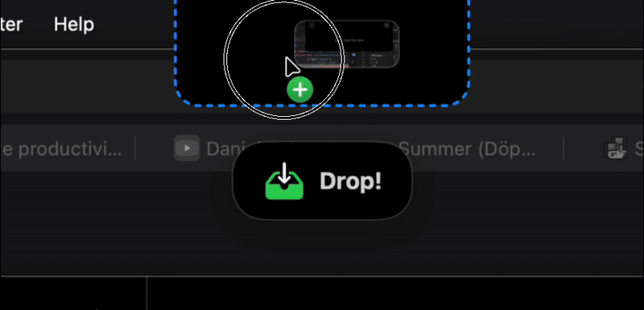
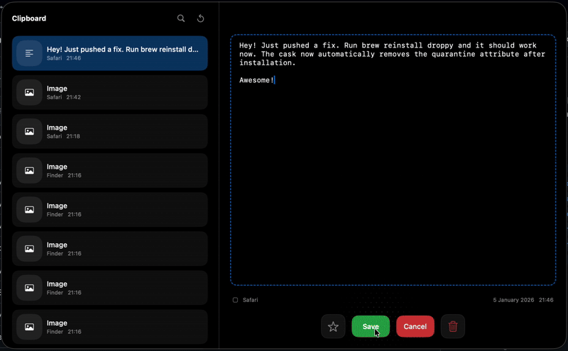
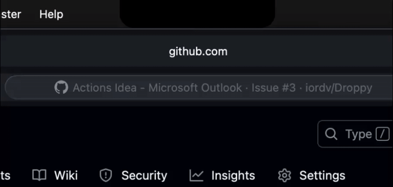
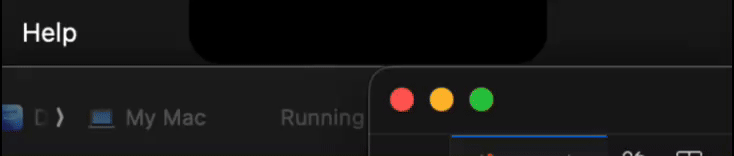

<p align="center">
  
</p>

<h1 align="center">Droppy</h1>

<p align="center">
  <strong>Your files. Everywhere. Instantly.</strong><br>
  <em>The free, open-source alternative to paid file management apps.</em>
</p>

<p align="center">
    <a href="https://iordv.github.io/Droppy/"></a>
    <a href="https://github.com/iordv/Droppy/releases/latest"></a>
    <a href="https://github.com/iordv/Droppy/releases/latest"></a>
    
    <a href="LICENSE"></a>
</p>

<p align="center">
  <a href="https://iordv.github.io/Droppy/">Website</a> •
  <a href="#-installation">Install</a> •
  <a href="#-core-features">Features</a> •
  <a href="#-how-to-use">Usage</a> •
  <a href="#-whats-new">Changelog</a>
</p>

---

<div align="center">


**Drag files to your notch • Summon the basket anywhere • Right-click for powerful actions**

</div>

---

<p align="center">
  🆓 <strong>100% Free & Open Source</strong> — No subscriptions. No ads. No tracking. Forever.<br>
  🖥️ <strong>Works on ANY Mac</strong> — Non-notch displays get a gorgeous Dynamic Island-style pill interface!
</p>

---

## ✨ Core Features

### Notch Shelf
Drag files to your notch — they vanish into a sleek shelf, ready when you need them.

<p align="center">
  
</p>

---

### Floating Basket
Jiggle your mouse while dragging to summon a basket anywhere on screen.

<p align="center">
  
</p>

---

### Clipboard Manager
Full history with search, favorites, OCR text extraction, and drag-out support.

<p align="center">
  
</p>

---

### Media Player
Now Playing controls in your notch with album art and seek slider.

<p align="center">
  
</p>

---

### Custom HUDs
Beautiful volume, brightness, battery, and Caps Lock overlays.

<p align="center">
  
</p>

---

## More Features

| Feature | Description |
|:--------|:------------|
|  **Native Spotify** | Shuffle, repeat, and rock-solid playback timing directly from Spotify |
| **Quick Actions** | Right-click any file for compress, convert, OCR, move, share, and more |
| **Move To...** | Send files directly to saved folder locations like your NAS or cloud drives |
| **Smart Compression** | Compress images, PDFs, and videos with auto or target size options |
| **Auto-Hide Basket** | Basket slides to screen edge when idle, peeks out on hover |
| **Multi-Monitor** | Works on external displays with smart fullscreen detection |
| **Dynamic Island** | Non-notch Macs get a beautiful floating pill interface |
|  **Alfred Integration** | Push files to Droppy from Alfred with a quick action |

---

## 📦 Installation

### Homebrew (Recommended)
```bash
brew install --cask iordv/tap/droppy
```

### Manual Download
1. Download [**Droppy.dmg**](https://github.com/iordv/Droppy/releases/latest)
2. Open the DMG and drag Droppy to Applications
3. **Important:** Before first launch, run this command in Terminal:
   ```bash
   xattr -rd com.apple.quarantine /Applications/Droppy.app
   ```
4. Open Droppy from your Applications folder

> ⚠️ **"Droppy is damaged and can't be opened"?**
> 
> This happens because macOS quarantines apps downloaded from the internet. The `xattr` command above removes this flag. This is safe — Droppy is open source and you can [verify the code yourself](https://github.com/iordv/Droppy).
>
> Alternatively, use **Homebrew** which handles this automatically.

---

## 🕹️ How to Use

### Stash Files
- **Notch**: Drag any file to the black area around your webcam
- **Basket**: While dragging, **shake your mouse left-right** — a basket appears at your cursor

### Quick Actions
Right-click any item in the shelf to:
- **Move To...** — Send to saved locations
- **Compress** — Auto or specify a target size
- **Convert** — e.g., HEIC → JPEG
- **Extract Text** — OCR to copy text from images
- **Share** or **Reveal in Finder**

### Drop Files
Drag files out of the shelf and drop into any app. The file moves and vanishes from the shelf.

### Clipboard Manager

| Action | Shortcut | Description |
|:-------|:---------|:------------|
| Open | `⌘ + Shift + Space` | Opens the clipboard history panel from anywhere |
| Navigate | `↑` `↓` | Move through your clipboard history |
| Paste | `Enter` | Paste the selected item and close |
| Search | `⌘ + F` | Filter items by text content |
| Favorite | `⭐` | Pin important items to the top |

> Works everywhere — even in password fields and Terminal.

---

## Pro Tips

###  Alfred Integration
Push files from Finder to Droppy: **Settings** → **About** → **Install in Alfred**, then use Alfred's Universal Actions on any file.

### Smart Compression
- **Auto**: Balanced settings for most files
- **Target Size**: Need under 2MB? Right-click → Compress → **Target Size...**
- **Size Guard**: If compression would make the file larger, Droppy keeps the original

### Drag-and-Drop OCR
Drag an image into Droppy, hold **Shift** while dragging out, and drop into a text editor — **it's text!**

### Auto-Hide Basket
Enable in Settings → Basket → **Auto-Hide**. The basket slides to the screen edge when not in use and peeks out on hover.

---

## 🆕 What's New

<details>
<summary><strong>v6.0 — Native Spotify Integration</strong></summary>

<!-- CHANGELOG_START -->
# Droppy v6.1 Release Notes

## ✨ New Features

### Auto-Clear
- Files are automatically cleared from shelf/basket after successful drop
- Toggle in Settings to enable/disable this feature
- Smoother workflow without manual cleanup

## 🎨 Improvements

- **Drag Feedback**: Enhanced visual feedback during drag operations
- **Item Wrapper UX**: Improved drag item wrapper behavior
- **Clipboard View**: Minor refinements to clipboard manager

## 🌐 Website

- **Theatre Mode**: Demo now fades surrounding content for focus
- **Faster Trigger**: Hover-to-demo reduced to 500ms
- **Mobile Support**: Tap-only demo trigger on mobile devices
- **Feature Showcase**: Added Alfred icon and grow animation
<!-- CHANGELOG_END -->

</details>

---

## ❤️ Support Droppy

<p align="center">
  <strong>Droppy is 100% free and open source — no ads, no subscriptions, ever.</strong><br>
  If it saves you time, consider fueling future development with a coffee!
</p>

<p align="center">
  <a href="https://buymeacoffee.com/droppy">
    
  </a>
</p>

---

## ⭐ Star History

<p align="center">
  <a href="https://star-history.com/#iordv/Droppy&Timeline">
    <picture>
      <source media="(prefers-color-scheme: dark)" srcset="https://api.star-history.com/svg?repos=iordv/Droppy&type=Timeline&theme=dark" />
      <source media="(prefers-color-scheme: light)" srcset="https://api.star-history.com/svg?repos=iordv/Droppy&type=Timeline" />
      
    </picture>
  </a>
</p>

---

<p align="center">
  <strong>MIT License</strong> — Free and Open Source forever.<br>
  Made with ❤️ by <a href="https://github.com/iordv">Jordy Spruit</a>
</p>
